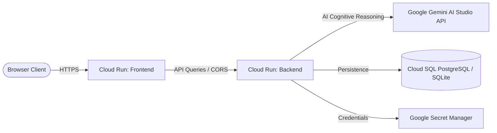

# Google Cloud Deployment Guide — Sentinel AI

This playbook guides you through the containerization and deployment of the **Sentinel AI Autonomous Cybersecurity Response Agent** onto **Google Cloud Platform (GCP)** using **Google Cloud Run**.

---

## Architecture Overview

On Google Cloud, the application runs as a secure, serverless multi-container system:



- **Project ID**: `lexical-tide-499609-j1`
- **Region**: `us-central1`

---

## Production Prerequisites

1. Install the [Google Cloud SDK](https://cloud.google.com/sdk/docs/install) on your local machine.
2. Initialize and authenticate with GCP:
   ```bash
   gcloud auth login
   gcloud config set project lexical-tide-499609-j1
   ```
3. Enable the required GCP Services:
   ```bash
   gcloud services enable \
     run.googleapis.com \
     artifactregistry.googleapis.com \
     cloudbuild.googleapis.com \
     secretmanager.googleapis.com
   ```

---

## Step 1: Secure API Keys with Google Secret Manager

Google Cloud best practices dictate that sensitive API credentials (such as the Gemini API Key) should **never** be stored in plaintext environment variables. We will store it in Google Secret Manager.

1. **Create the Secret**:
   ```bash
   gcloud secrets create GEMINI_API_KEY \
       --replication-policy="automatic" \
       --data-file=- <<EOF
   your_actual_gemini_api_key_here
   EOF
   ```
   *(Or enter the value interactively using `gcloud secrets versions add`).*

2. **Grant Access to the Cloud Run Service Account**:
   By default, Cloud Run services run as the Compute Engine default service account: `PROJECT_NUMBER-compute@developer.gserviceaccount.com`.
   ```bash
   PROJECT_NUMBER=$(gcloud projects describe lexical-tide-499609-j1 --format="value(projectNumber)")
   
   gcloud secrets add-iam-policy-binding GEMINI_API_KEY \
       --member="serviceAccount:${PROJECT_NUMBER}-compute@developer.gserviceaccount.com" \
       --role="roles/secretmanager.secretAccessor"
   ```

---

## Step 2: Create Artifact Registry Repository

Google Artifact Registry stores the built Docker containers for the backend and frontend.

```bash
gcloud artifacts repositories create sentinel-ai-repo \
    --repository-format=docker \
    --location=us-central1 \
    --description="Sentinel AI Docker Registry"
```

Configure Docker to authenticate with the registry locally (if building locally):
```bash
gcloud auth configure-docker us-central1-docker.pkg.dev
```

---

## Step 3: Containerize and Deploy the Backend

The backend needs to be deployed first so we can obtain its public URL, which is needed by the frontend at build time.

1. **Build and Tag Backend via Cloud Build**:
   Instead of building locally, submit the build directly to GCP Cloud Build, which builds the image in the cloud:
   ```bash
   gcloud builds submit --tag us-central1-docker.pkg.dev/lexical-tide-499609-j1/sentinel-ai-repo/backend:latest ./backend
   ```

2. **Deploy to Cloud Run**:
   We bind the `GEMINI_API_KEY` secret directly as an environment variable and configure other necessary variables:
   ```bash
   gcloud run deploy sentinel-backend \
       --image us-central1-docker.pkg.dev/lexical-tide-499609-j1/sentinel-ai-repo/backend:latest \
       --platform managed \
       --region us-central1 \
       --allow-unauthenticated \
       --set-secrets="GEMINI_API_KEY=GEMINI_API_KEY:latest" \
       --set-env-vars="DATABASE_URL=sqlite+aiosqlite:///./sentinel.db,JWT_SECRET=supersecretjwtsecretkeysentinelai12345,ADMIN_USERNAME=admin,ADMIN_PASSWORD=sentinelpass123,ACCESS_TOKEN_EXPIRE_MINUTES=120"
   ```

3. **Capture the Backend Service URL**:
   The output of the command will print a Service URL, for example:
   `https://sentinel-backend-xxxxxx-uc.a.run.app`
   *(Copy this URL for the next step).*

---

## Step 4: Containerize and Deploy the Frontend

Vite applications embed environment variables at build-time. We must pass the Backend URL as a build argument when compiling the frontend image.

1. **Build Frontend via Cloud Build**:
   Replace `BACKEND_URL` with the URL captured in Step 3.
   ```bash
   gcloud builds submit \
       --tag us-central1-docker.pkg.dev/lexical-tide-499609-j1/sentinel-ai-repo/frontend:latest \
       --build-arg VITE_API_BASE_URL="https://sentinel-backend-xxxxxx-uc.a.run.app" \
       ./frontend
   ```

2. **Deploy Frontend to Cloud Run**:
   ```bash
   gcloud run deploy sentinel-frontend \
       --image us-central1-docker.pkg.dev/lexical-tide-499609-j1/sentinel-ai-repo/frontend:latest \
       --platform managed \
       --region us-central1 \
       --allow-unauthenticated
   ```

3. **Verify Deployment**:
   Open the printed frontend Service URL (e.g. `https://sentinel-frontend-xxxxxx-uc.a.run.app`) to access your live cybersecurity response agent.

---

## Production Security and Architecture Guidelines (Best Practices)

### 1. Database Persistence
By default, the backend configures `DATABASE_URL` to SQLite (`sqlite+aiosqlite:///./sentinel.db`). 
- **Warning**: Cloud Run containers are stateless and ephemeral. If a container recycles or autoscales down, all locally written incidents and logs will be lost.
- **Production Solution**: Create a **Google Cloud SQL for PostgreSQL** instance. 
  - Install postgres libraries (`asyncpg`, `psycopg2-binary`) in `requirements.txt`.
  - Connect via Cloud SQL Connector or by mounting the database connection:
    ```bash
    DATABASE_URL=postgresql+asyncpg://<db_user>:<db_pass>@/<db_name>?host=/cloudsql/<CONNECTION_NAME>
    ```

### 2. Startup & Autoscaling Tuning
To optimize responsiveness and keep costs low:
- Set minimum instances to `0` to save on idling fees.
- Set CPU allocation to `CPU is only allocated during request processing` to reduce runtime costs.
- Grant Cloud Run's service account permissions to log directly to **Google Cloud Logging** (automatically managed by the FastAPI logger).

### 3. Monitoring
Use **Google Cloud Monitoring** and **Cloud Trace** to visualize HTTP request latency and backend AI API latency.
