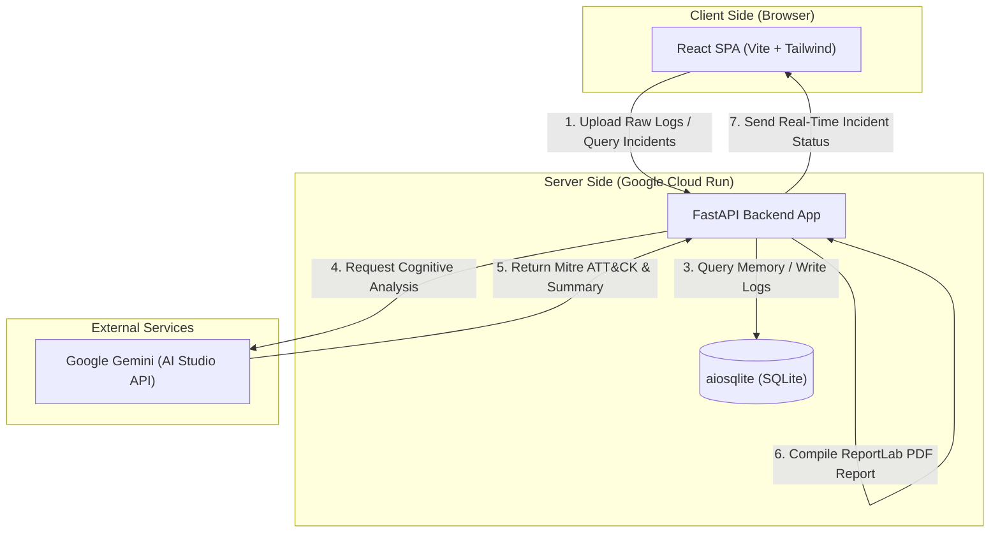
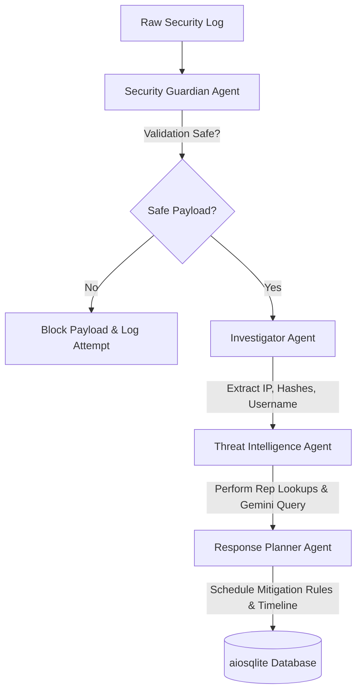
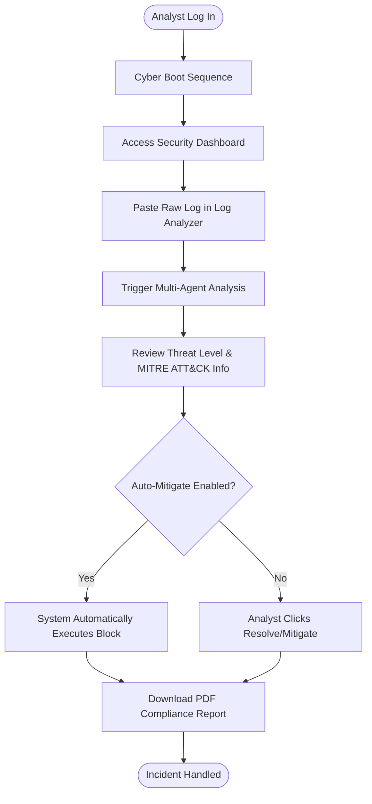
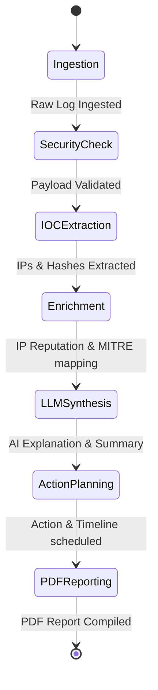
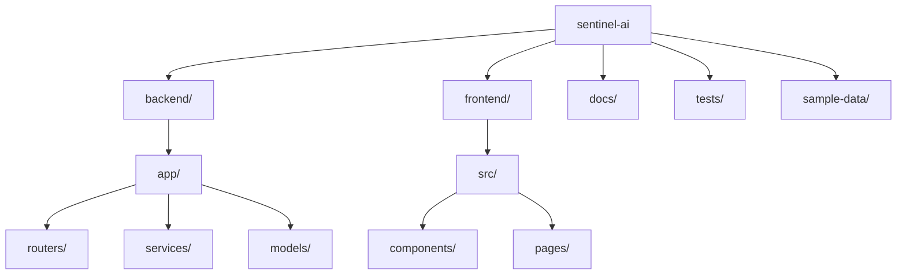
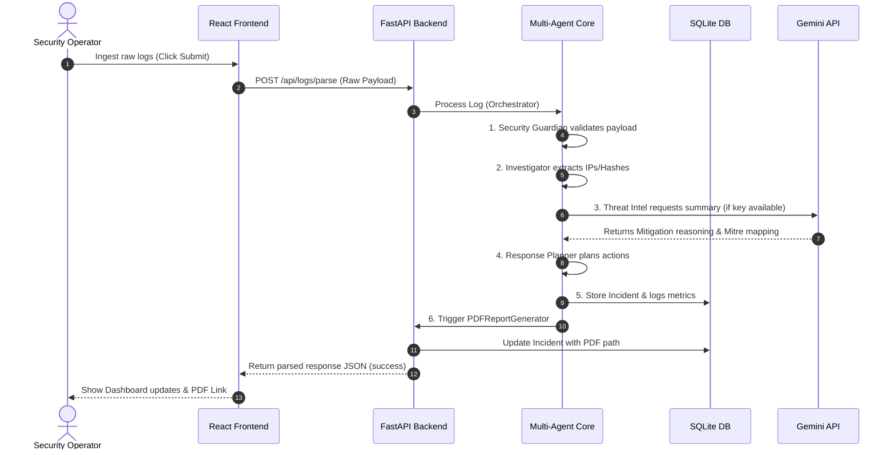
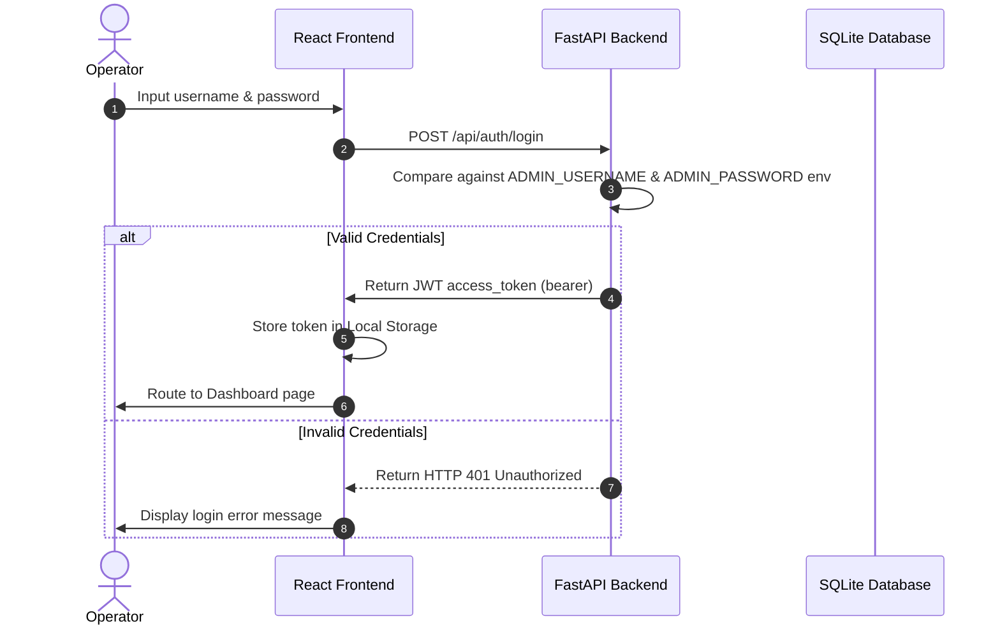
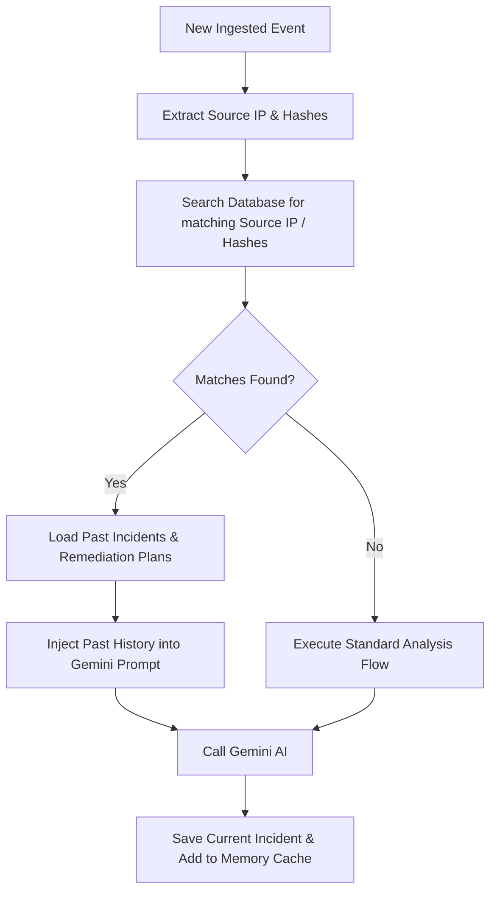
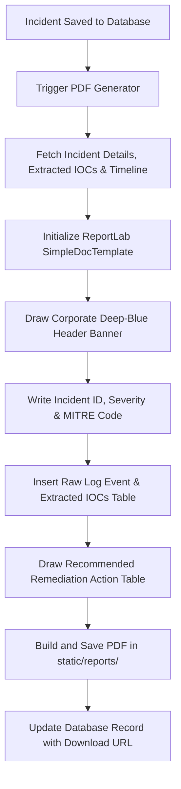

# Sentinel AI – Autonomous Cybersecurity Response Agent

<p align="center">
  
</p>

<p align="center">
  <strong>Autonomous, multi-agent cognitive threat detection, intrusion analysis, and containment response system.</strong>
</p>

<p align="center">
  
  
  
  
  
  
  
  
  
</p>

---

## 📖 Project Overview

**Sentinel AI** is an advanced autonomous cybersecurity incident response agent created for the **Google × Kaggle GenAI Capstone**. Sentinel AI intercepts security events, parses complex logs, rates threat risk scores, maps attacks to the **MITRE ATT&CK Matrix**, and automatically initiates mitigation playbooks.

By utilizing the cognitive reasoning capabilities of **Google Gemini**, Sentinel AI bridges the gap between raw data ingestion and active network defense. The application is designed to ingest logs from firewalls, operating systems, and network probes, immediately running security assessments and delivering compliance-ready ReportLab PDF summaries.

---

## ✨ Key Features

- **Multi-Agent Collaboration**: Divided cognitive labor between specialized agents (Guardian, Investigator, Threat Intelligence, and Response Planner).
- **Intelligent Log Ingestion**: Support for Linux auth logs, Windows security events, firewall logs, and Nmap probe dumps.
- **MITRE ATT&CK Alignment**: Dynamic mapping of intrusion indicators to standard tactics and techniques (e.g., Brute Force, DNS Tunneling).
- **Autonomous Containment**: Automatic configuration updates for firewalls, user lockouts, and process terminations based on configurable threat thresholds.
- **Explainable AI Insights**: Human-readable explanations detailing why a threat was categorized, helping analysts debug zero-day alerts.
- **Semantic Historical Memory**: Fast correlation database queries to identify persistent threat groups and repetitive intrusion behaviors.
- **Real-Time Observability**: Latency breakdown charts tracking LLM call delays, token expenditures, and cost metrics.
- **PDF Report Compiling**: Automated generation of styled, executive-ready PDF reports on threat containment.

---

## 🛠️ Technology Stack

- **Frontend**: React 19 SPA, Vite 8, Tailwind CSS 4, Framer Motion (micro-animations), Recharts (data visualizations), React Router DOM.
- **Backend**: FastAPI (Python 3.11), SQLAlchemy 2 (asynchronous ORM), aiosqlite (async driver for SQLite), Pydantic Settings, google-generativeai SDK.
- **Reporting Engine**: ReportLab 4.1.0.
- **Deployment**: Docker, Nginx, Google Cloud Run, Google Artifact Registry, Google Secret Manager.

---

## 📐 Architecture Diagrams

### 1. System Architecture
The flowchart below maps the data progression from log files through the backend API, database, Gemini AI engine, and interactive frontend.



### 2. Multi-Agent Flow
Sentinel AI utilizes specialized agents working sequentially to evaluate security events.



### 3. User Workflow
The operational workflow for a security analyst interacting with the Sentinel AI dashboard:



### 4. Incident Investigation Pipeline
The lifecycle stages of security data during log parsing and threat enrichment:



### 5. Application Folder Structure
Logical organization of the repository's folders and modules:



### 6. Deployment Architecture
High-availability target architecture on Google Cloud Platform:

```mermaid
graph TD
    subgraph GCP ["Google Cloud Platform (lexical-tide-499609-j1)"]
        subgraph Registry ["Google Artifact Registry"]
            BEImg[Backend Container Image]
            FEImg[Frontend Container Image]
        end
        subgraph Secrets ["Google Secret Manager"]
            GeminiKey[GEMINI_API_KEY Secret]
        end
        subgraph Runtime ["Serverless Runtime"]
            FECnt[Cloud Run: Frontend Service]
            BECnt[Cloud Run: Backend Service]
        end
    end
    
    Developer[Developer] -->|git push / gcloud builds| Registry
    BECnt -->|Read Secret| GeminiKey
    FECnt -->|CORS API Requests| BECnt
    FECnt <--|Serves Web Client| Browser([Browser Client])
    BECnt -->|Cognitive Call| GeminiExternal([Google Gemini AI Studio])
```

### 7. Request Flow
Sequential request routing when an analyst triggers a manual log analysis:



### 8. Authentication Flow
Security sequence to log in and access protected dashboard features:



### 9. Memory Flow
Retrieving and injecting historical event context into current threat analysis:



### 10. Report Generation Flow
Executing the ReportLab compiling engine to output audit compliance documents:



---

## 📂 Folder Structure

```
sentinel-ai/
├── .github/workflows/       # GitHub Actions CI Configurations
├── backend/
│   ├── app/
│   │   ├── models/          # SQLAlchemy Database Schemas
│   │   ├── routers/         # API Routing (Incidents, Auth, Logs, Observability)
│   │   ├── services/        # Multi-Agent Logic & Utilities
│   │   ├── config.py        # Pydantic Configuration Loader
│   │   ├── database.py      # SQLAlchemy Session Initialization
│   │   └── main.py          # FastAPI Core Setup
│   ├── static/reports/      # Output PDFs (Ignored by VCS)
│   ├── Dockerfile           # Backend Container Definition
│   └── requirements.txt     # Python Dependencies
├── frontend/
│   ├── src/
│   │   ├── components/      # UI Blocks (Metric Cards, AI Chat Widget)
│   │   └── pages/           # Pages (Dashboard, Settings, Observability)
│   ├── Dockerfile           # Frontend Container Definition
│   └── nginx.conf           # Production Nginx Proxy Config
├── docs/                    # Deep-dive Module Documentation
├── sample-data/             # Ingestion Log Templates
├── tests/                   # Automated Pytest Suite
├── docker-compose.yml       # Local Development Orchestration Script
└── DEPLOYMENT.md            # GCP Deployment Playbook
```

---

## 🚀 Installation & Local Setup

### Prerequisites

- **Python 3.11+**
- **Node.js v20+**
- **Google AI Studio API Key** (from [Google AI Studio](https://aistudio.google.com/))

### 1. Environment Configuration

#### Backend Env
Create a `.env` file inside the `backend/` directory:
```env
GEMINI_API_KEY=your_gemini_api_key_here
DATABASE_URL=sqlite+aiosqlite:///./sentinel.db
JWT_SECRET=supersecretjwtsecretkeysentinelai12345
ACCESS_TOKEN_EXPIRE_MINUTES=60
ADMIN_USERNAME=admin
ADMIN_PASSWORD=sentinelpass123
```

#### Frontend Env
Create a `.env` file inside the `frontend/` directory:
```env
VITE_API_BASE_URL=http://localhost:8000
```

---

### 2. Local Setup (Without Docker)

#### Running the Backend
```bash
cd backend
python -m venv venv
# Activate virtual environment
# Windows (PowerShell):
venv\Scripts\Activate.ps1
# Linux / macOS:
source venv/bin/activate

pip install -r requirements.txt
uvicorn app.main:app --host 127.0.0.1 --port 8000 --reload
```

#### Running the Frontend
```bash
cd frontend
npm install
npm run dev
```
Open `http://localhost:5173` in your browser.

---

### 3. Local Setup (With Docker Compose)

To start both the frontend and backend containerized and linked automatically:
```bash
docker compose up --build
```
Open `http://localhost:3000` to view the web client.

---

### 4. Running Automated Tests

To run the backend FastAPI test suite:
```bash
cd backend
pytest
```

---

## ☁️ Deployment Instructions

The project is pre-configured for deployment on Google Cloud Platform.
Detailed instructions for setting up Google Artifact Registry, building containers via Cloud Build, configuring Secret Manager, and deploying to **Google Cloud Run** are available in [DEPLOYMENT.md](./DEPLOYMENT.md).

---

## 🔮 Future Improvements

- **Production Cloud SQL Database Integration**: Migrating database layers to highly resilient PostgreSQL instances.
- **Log Streaming Connectors**: Direct integrations with cloud logging pipelines (AWS CloudWatch, Google Cloud Logging, Splunk).
- **Advanced Vector Memory**: Utilizing pgvector or Vertex AI Vector Search for ultra-fast security vector retrieval.
- **Two-Factor Authentication (2FA)**: Restricting operator control and mitigation execution behind biometric or TOTP secondary tokens.

---

## 📄 License

This project is licensed under the MIT License - see the [LICENSE](./LICENSE) file for details.

---

## 🤝 Acknowledgements

- Google Generative AI Team for the Gemini API.
- Kaggle Capstone Organizers for the GenAI Cyber Response challenge.
- The open-source security community for compiling standard IOC signatures.
