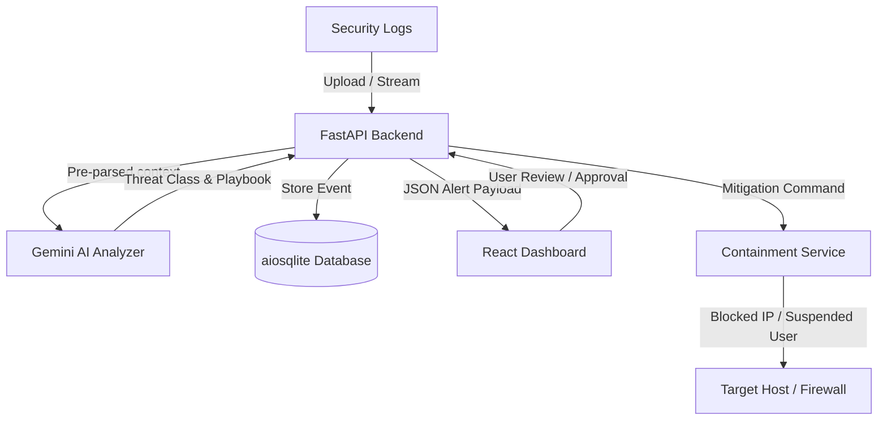

# Sentinel AI System Architecture

This document describes the flow of information and components inside the Sentinel AI Autonomous Response Agent.

## Core Loop Diagram

## Security Containment Actions (Mocked)
For safety during sandbox demonstrations, the action planner targets:
1. **Network Block**: Modifies simulated firewall rules (or a local SQLite list of blocked IPs).
2. **User Lockout**: Disables local test users or updates their state to suspended.
3. **Process Kill**: Simulates terminating a PID or malicious service.
