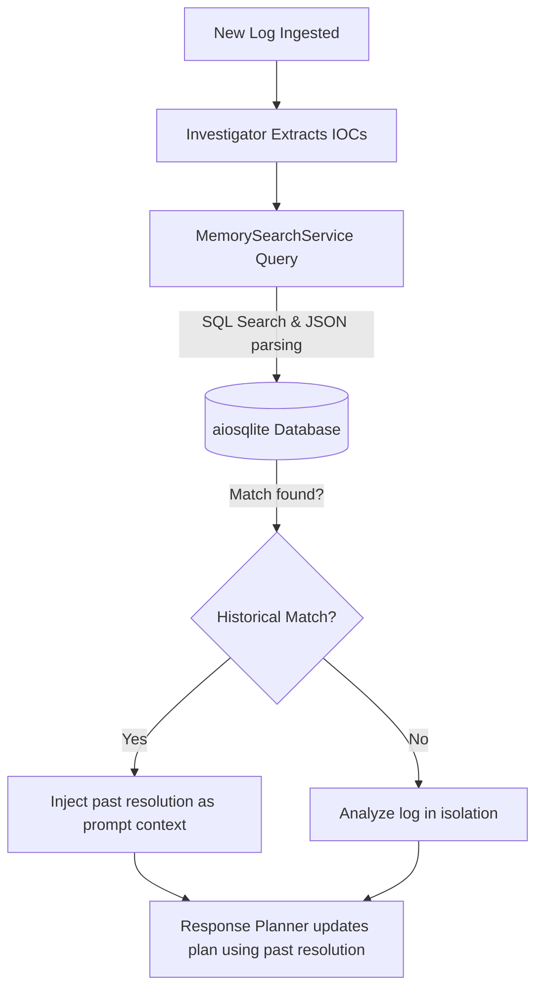

# Semantic Memory Documentation

Sentinel AI incorporates a **Semantic Memory Service** to provide historical context. When a new threat is ingested, the agents query the memory bank to see if similar IOCs (IPs, hashes, usernames) have been observed in previous incidents.

## Interface Overview

*Figure 5: Semantic Memory Search and Historical Context Panel*

The Memory View includes:
- **Search Bar**: Allows searching for historical IPs, hashes, or attack patterns.
- **Similarity Thresholds**: Shows matches ranking above similarity score bounds.
- **Memory Card Grids**: Chronological list of historical context blocks including when the threat was first identified, matching mitigation actions, and the results of past containment actions.

---

## Memory Retrieval Flow

---

## Schema and Structure

Semantic memory entries are stored as structured JSON dumps inside the SQLite database, referencing `evidence` and `remediation_plan` fields. The `MemorySearch` service queries previous incident records and evaluates correlation factors (e.g., matching subnet masks or similar malware hashes) to determine whether a recurrent campaign (e.g., persistent threat actor group) is targeting the environment.
